s# NYC Taxi Impact
## Team Members
**Jorge Reyes** 
**Megan O'Connor** 
**Valdeir Faria F** 
**Aysenyr Teyfur** 

## Project Overview
Our goal with this project is to understand traffic and congestion patterns and fare and revenue trends within New York City for Green Taxis, which will uncover travel behavior before the pandemic when public transportation was heavily used.

### Project Questions
- Is trip length a good indicator of tip amount?
- Is there a statistically significant difference between trip demand on weekends and weekdays?
- Is trip distance a good indicator of trip duration?

### Index
- [Green Taxi: Ride Duration Analysis](Green-Taxi-Only-Analysis/Green-Taxi-ONLY-Tip-Analysis.ipynb)
- [Green Taxi: Tip Behavior](Green-Taxi-Only-Analysis/Green-Taxi-ONLY-Traffic-and-Congestion-Analysis.ipynb)

[Presentation](NYC_Taxi_Impact_Presentation.pdf)

## Description of Data Sources
- [NYC Taxi - Green Taxi Data](https://learn.microsoft.com/en-us/azure/open-datasets/dataset-taxi-green?tabs=azureml-opendatasets): Taxi data for green taxis in NYC
- [NYC Taxi - Yellow Taxi Data](https://learn.microsoft.com/en-us/azure/open-datasets/dataset-taxi-yellow?tabs=azureml-opendatasets): Taxi data for yellow taxis in NYC
- [NYC Taxi Zones](https://data.cityofnewyork.us/Transportation/NYC-Taxi-Zones/d3c5-ddgc): Taxi zone data containing names of the neighborhoods and boroughs.

### Data Exploration
The team started with the Green Taxi dataset and added the Yellow Taxi data for comparative analysis. The Taxi Zone data was added to provide more granular information about trip routes. These datasets were cleaned by removing duplicate rows and dropping unnecessary and empty columns. 

## Technologies Used
We used a variety of different technologies and libraries for this project. 
- **Data Transformation** Python(pandas, datetime, dateutil), Jupyter Notebook, csv file 
- **Analysis** Python (pandas, matplotlib, seaborn, scipy. stats), Jupyter Notebook, CSV file 

## Data Transformation
This dataset contains 923,257 rows of data. It was filtered between Q1 2016 (2016-01-01 to 2016-31-01-2016). Several columns had null values due to being discontinued throughout the years. Additional columns were created to clean and provide additional date and time information. Binned data was also produced to create categorical variables for measurement variables.

## Data Analysis
### Ride Duration Analysis
In analyzing if there was a statistically significant difference between trip demand on weekends vs weekdays, it was found there is likely a difference. Regression analysis found that trip distance could have been a better indicator of how long the taxi ride would be, likely due to the varying traffic throughout the day and night in New York. 
 
On average, a taxi ride is 23 minutes. Riders traveling at 6 am have high expected travel times. During the week, those average travel times add roughly 7 minutes to the morning commute. Afternoon travel times deviate from the average between 2 and 4 pm but add 3 to 4 minutes to the expected travel time. 
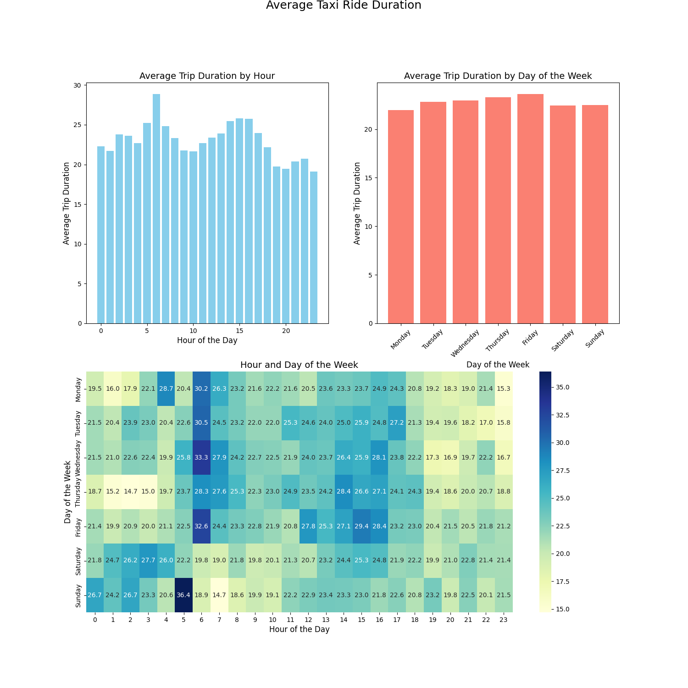
It is quite impressive that despite the high afternoon demand, average taxi ride times are still generally quite low. The graphs below highlight taxi demand for different times and days of the week. The darkness in the heatmap highlights the heavy demand between 2 pm and 7 pm. When comparing the two heatmaps, one can see that despite the demand lasting until 7 pm, the average duration of the rides begins to decrease around 5 pm. More information on why average trip times decrease around 7 pm is given from the heatmap of Average Trip Distance by Hour and Day of the Week. In the evening, trip distance begins to decrease. In the mornings and during the workday, average trip distances are higher than the average of 3 miles, peaking at 5.5 miles between 5 am and 7 am on weekdays. 
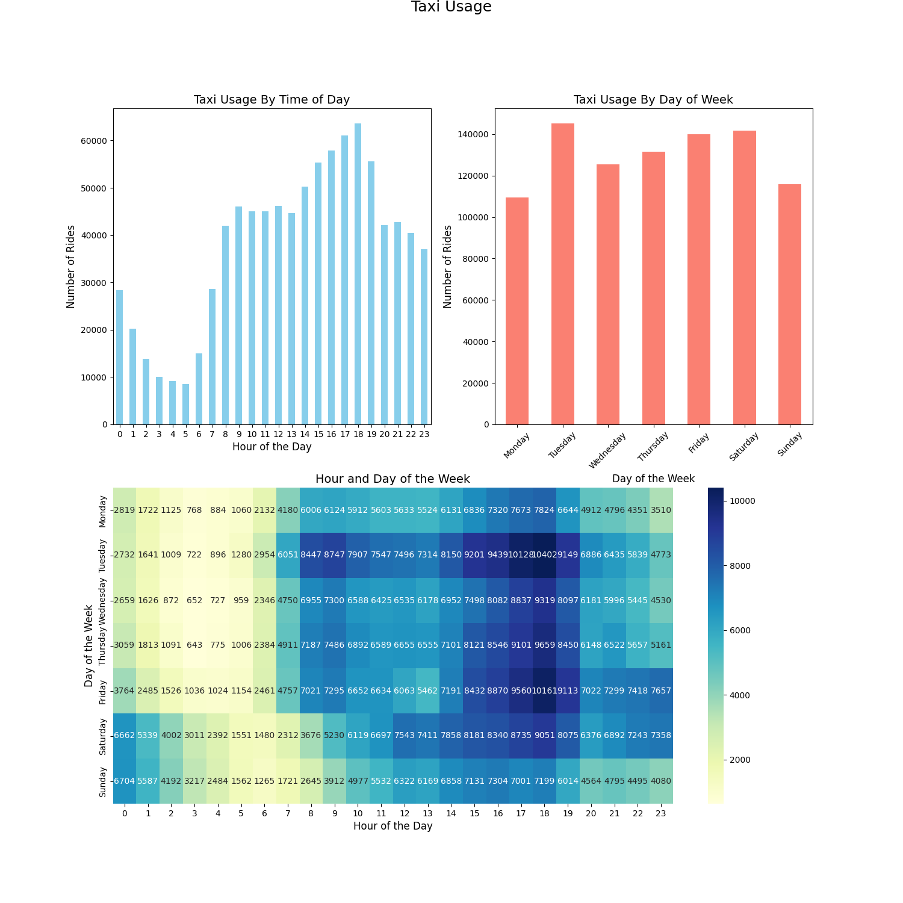

#### Between Borough Demand
When looking at travel between different boroughs, popular routes are those from Brooklyn to Manhattan, Manhattan to the Bronx and Queens to Manhattan. Demand for the route from Brooklyn to Manhattan was relatively stable throughout the day, calming down around 2 am and picking up around 7 am, despite the average trip distance being one of the highest of the most popular between borough travel routes at 14.5 miles. When looking at demand by day of the week, there is a higher demand on the weekend than during the week, especially on Saturdays, to go from Brooklyn to Manhattan, which aligns with the increased demand in the later hours of the day, as people may be going to Manhattan for the nightlife. 
 
Manhattan to the Bronx is the most popular route, even though the average travel distance is 4 miles. Demand picks up throughout the day, peaking between 6 and 8 pm and slowly calming down around midnight. Looking at demand throughout the week shows that this route is more likely to be traveled between Tuesday and Saturday. 
 
The third most popular borough route is from Queens to Manhattan, where most demand is between 7 am and 1 pm. This route has a high demand throughout the week, with the highest demand on Saturday. 
The reverse trip demand aligns differently from the number of rides requested for these routes. For example, the demand for taxi rides from Brooklyn to Manhattan has the highest remand outside of within-borough travel. However, few trip requests from Manhattan to Brooklyn indicate that other means of transportation are used to travel back to the pickup location or other means of transportation were used to get to the initial pickup location. 
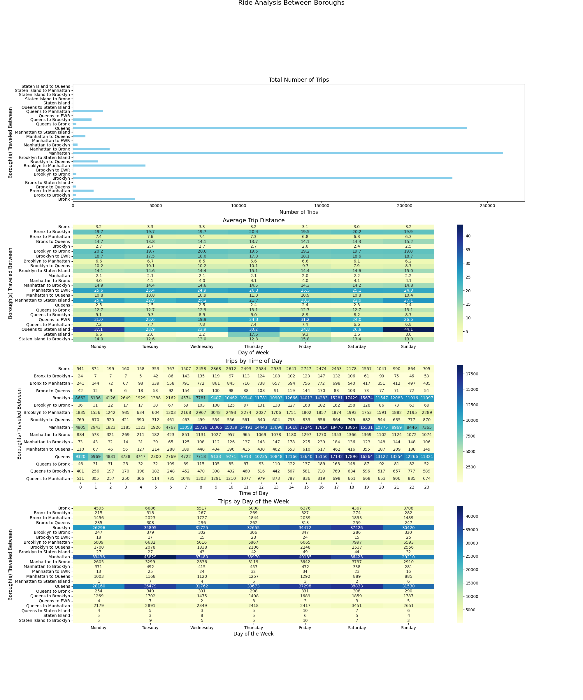
##### Popular Drop-Off Neighborhoods in Manhattan
Several neighborhoods are close to one another that are famous drop-off neighborhoods: Harlem (Central, Central North, East North, and East South), Morningside Heights, Upper East Side North, Upper West Side North, Hamilton Heights, and Washington Heights South. All of these locations are on the north side of Manhattan. 
 
When looking at trips closer from Brooklyn to Manhattan, the most popular drop-off locations are Tribeca/Civic Center, the Lower East Side, and East Village. Tribeca has a significant demand between 8 am and 8 pm. For the Lower East Side and East Village, most riders are getting rides over in the evening and into the late night, where demand slowly begins picking up at 4 pm and slowing down around 3 am. On the weekend, the most popular destinations are the East Village, the Lower East Side, and Little Italy. For riders looking to go to Little Italy, most are looking to go between 8 am and 7 pm. During the week, the most popular destination is Tribeca/Civic Center. 

### Tipping Behavior
As expected, tipping behavior varies by the distance traveled, with the average tip being higher the further you travel. Time of day and day of the week have less to do with the average tip, as shown when creating a simple linear regression model using each variable. Both had r-squared values close to 0, meaning that they explained little about the variation in the expected tip amount for taxi rides.  
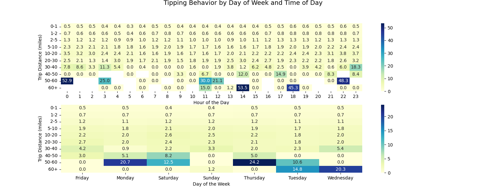

### Most common payment method for green taxis and yellow taxis
In Q1 2016, cash was the most common payment method for both green and yellow taxis, accounting for 50% of all transactions. Credit card payments were also prevalent, making up 47% of the payments. The remaining 3% of the transactions were either free rides, discounted fares, or disputed charges. This distribution highlights taxi passengers' significant reliance on cash and credit cards during this period.
It is interesting that in 2016, cash was still a relevant method of payment. 

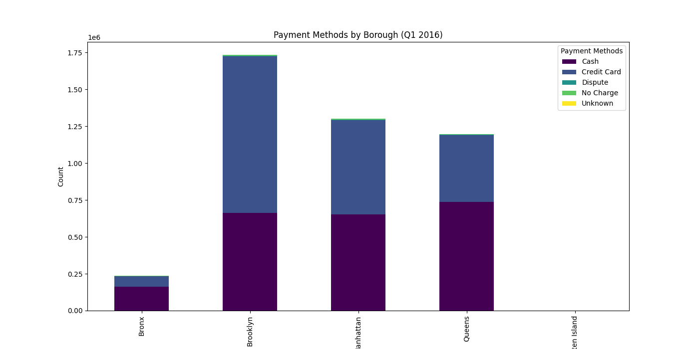
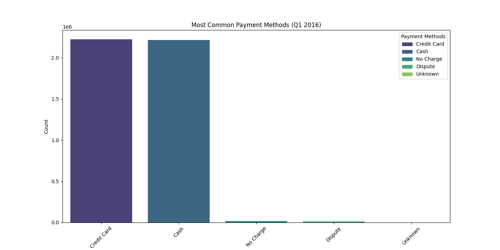
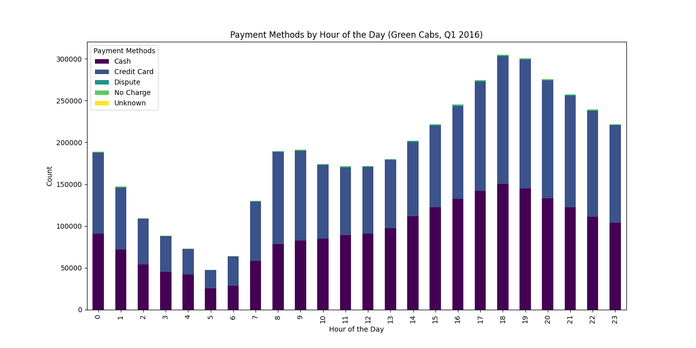

### Green compared to yellow - overview of findings
Based on findings from Q1 2016, there is a significant difference in the operational focus and ride volume between yellow and green taxis in New York City. During this period, yellow taxis experienced six times the number of rides per month compared to green taxis, underscoring their dominance in the market. This higher volume can be attributed to their primary service area, primarily concentrated in Manhattan. Yellow taxis had a minimal presence in other boroughs, indicating that their operations were heavily centered around Manhattan's bustling, densely populated, and commercially vibrant areas.
In contrast, green taxis provided a more evenly distributed service across all boroughs of New York City. While they had a presence in Manhattan, their ride volume in this area was significantly lower than that of yellow taxis. This broader service area meant green taxis were more accessible to residents in the outer boroughs, offering a crucial transportation option where yellow taxis were less prevalent.
The data from Q1 2016 suggests that yellow taxis were dedicated to servicing Manhattan, capitalizing on the high demand in this central location. Meanwhile, green taxis served most of the city, ensuring that areas outside Manhattan were not neglected. This distinction in service areas and ride volumes reflects the strategic, and operational differences between the two taxi services, with yellow taxis focusing on high-density, high-demand zones and green taxis providing widespread coverage throughout New York City.

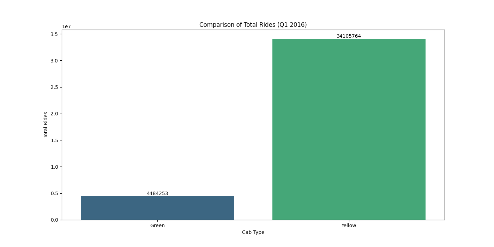

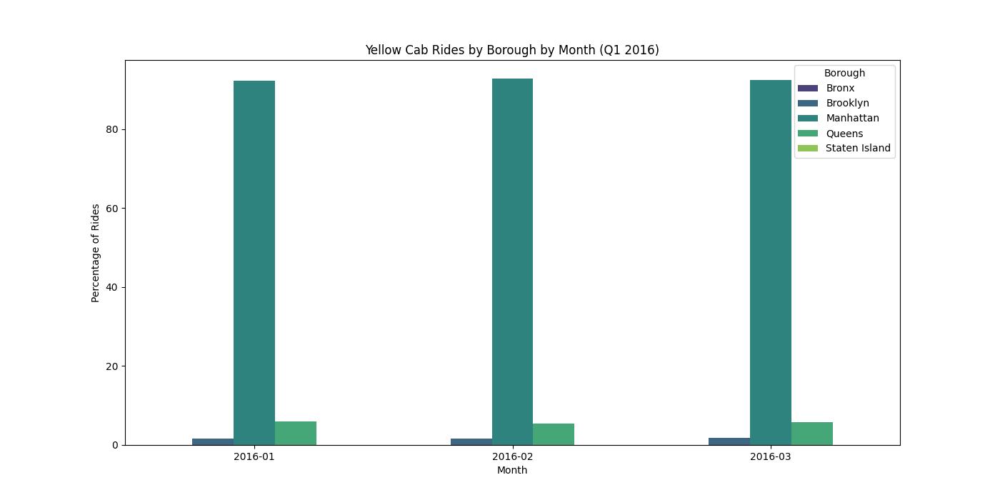
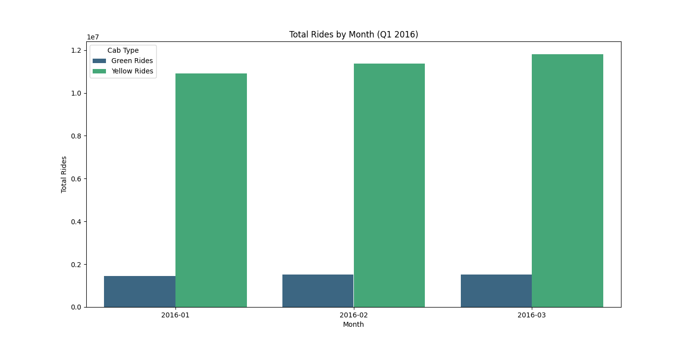
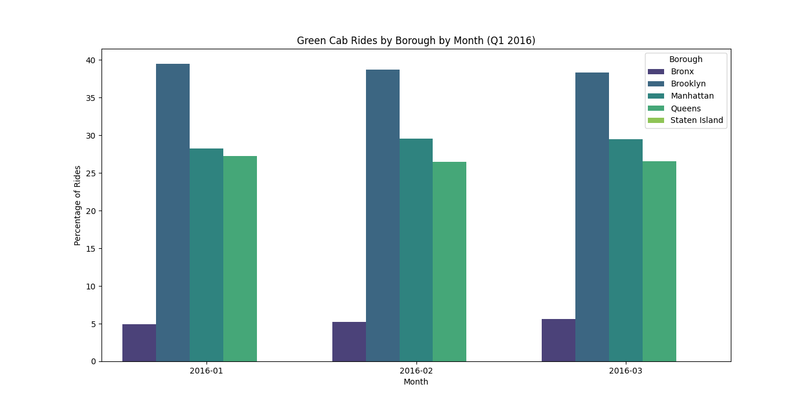

### Boroughs for green taxis vs yellow taxis

## Presentation
PowerPoint Deck summarizing our project: [Presentation](NYC_Taxi_Impact_Presentation.pdf)

## Resources
### Analysis Files
- [Green Taxi: Ride Duration Analysis](https://github.com/thecolombian/Group-Project-NY-Green_taxi/blob/main/Green-Taxi-Only-Analysis/Green-Taxi-ONLY-Traffic-and-Congestion-Analysis.ipynb)
- [Green Taxi: Tip Behavior](https://github.com/thecolombian/Group-Project-NY-Green_taxi/blob/main/Green-Taxi-Only-Analysis/Green-Taxi-ONLY-Tip-Analysis.ipynb)
### Images
- [Green Taxi: output_data](https://github.com/thecolombian/Group-Project-NY-Green_taxi/tree/main/Green-Taxi-Only-Analysis/output_data)
